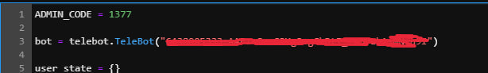
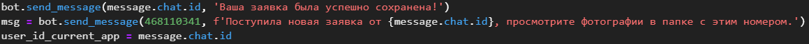

# Решение команды ЗдрыпикиИИ

Схема файлов в репозитории:   
├── bot    
│    ├── bot.ipynb    
│    ├── Database.db    
│    ├── administrators.db     
│    └── applications.db    
│   
├── model    
│    └── clip.ipynb    
│     
├── test data - для открытого репозитория только фотографии из интернета 
│    ├── from_internet/   
│    │     ├── alarm_key.jpg   
│    │     └── ...   
│    └── photos/   
│    │       ├── IMG_20231021_165209.jpg   
│    │       └── ...   
├── requirements.txt    
└── README.md     

## Как пользоваться
1. Запускаем бота @check_requirements_bot
2. Пишем /start
3. Появляется меню с кнопками, нажимаем на кнопку "Регистрация пользователя"
4. Вводим свое имя
5. Вводим свою фамилию
6. Вводим свой номер телефона
7. После сообщения об успешной регистрации появляется ещё одно меню с кнопками, здесь нажимаем на "Создать новую заявку"
8. Выбираем кнопку что хотим застраховать машину или дом
9. При выборе машины, приходит сообщение "Пришлите описание объекта"
10.  Присылаем описание объекта простым вводом текста в сообщении
11.  Дальше нужно отправить VIN-номер, убедитесь что фото должно быть отправлено в виде файла(т.е отправлено не напрямую через галерею) и фото должно иметь разрешение jpg, дальше все требования для фото будут такими же
12.  Дальше отправляем 8 фото машины с 4 сторон и 4 углов, отправляться они должны ОТДЕЛЬНЫМИ ФАЙЛАМИ 
13.  Высылаем одно фото лобового стекла и одно фото маркировки, отправляться они должны отдельными файлами 
14.  Дальше отправьте одно фото колеса в сборе
15.  Затем отправьте одно фото, где видно показания одометра
16.  Дальше отправьте одно фото передней части салона с приборной панелью и одно фото задней части салона, фото должны присылаться отдельными файлами
17.  Дальше пришлите все фото повреждений, если таковые имеются , фото должны присылаться отдельными файлами, если повреждений нет, то нажимайте кнопку "Далее"
18.  Отправьте фото штатных ключей или прочих автоугонных устройств, все файлы должны присылаться отдельно, если таковых нет, нажимайте кнопку "Далее"
19.  Далее вы можете проверить статус своей заявки по команде которая высетится в сообщении(просто кликните на текст подсвечивающийся голубым)
* Note: Если вы встретились с багом - отправьте /start

## Развертывание
* Note: На данный момент, уже запущен тг-бот @check_requirements_bot. У данного бота токен такой же, как и в файле bot.ipynb, поэтому могут возникнуть проблемы с запуском. Для создания своего токена напишите боту @BotFather. Следуйте инструкции и получите уникальный токен. Вставьте данный токен в bot.ipynb (5 ячейка, 3 строка).
.
1. Склонируйте данный репозиторий к себе.
2. Зайдите на https://colab.research.google.com/.
3. Нажмите "Файл", далее "Открыть блокнот".
4. Загрузите базы данных applications.db, adminstrators.db, Database.db и bot.ipynb из папки репозитория 'adventure-league-k2/bot/' в Google Colab.
4. Проверьте, что базы данных и файл bot.ipynb лежат в одной папке.
5. Запустите bot.ipynb.
7. Откройте тг-бот и зарегистрируйтесь в качестве администратора.
8. Откройте базу данных adminstrators.db и найдите строку с фамилией и именем зарегистрировавшегося администратора. В данной строке в столбце user_id скопируйте номер.
6. Вставьте данный номер вместо зеленого номера в bot.ipynb (изображен на картинке снизу, ячейка 5, строка 348)
.
7. Перезапустите bot.ipynb.
8. Откройте тг-бот. При правильном выполнении всех предыдущих пунктов тг-бот будет функционировать в полном объеме. В противном случае, вы сможете пользоваться лишь функционалом клиента.

Требования к библиотекам находятся в requirements.txt 

[Дополнительные требования для установки](https://github.com/OpenAI/CLIP) CLIP в официальном репозитории от OpenAI

## Данные
Примеры данных можно найти в папке test data: from-internet были взяты из интернета, photos - сделаны нами.
Рекомендуется их проверять в clip.ipynb, т.к. git сжимает файлы и, скорее всего, теряются метаданные. Либо необходимо закомментировать проверку метаданных в bot.ipynb.

## Как зайти администратором
Для упрощения, текущий код для доступа к правам администратора - 1377       

*при внедрении в бизнес необходимо усложнить ключ администратора, или добавлять новых администраторов вручную, т.к. их обычно немного*

